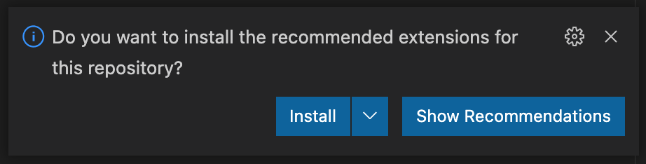

# Opus API

## Tabla de contenidos

- [Opus API](#opus-api)
  - [Tabla de contenidos](#tabla-de-contenidos)
  - [Descripción y contexto](#descripción-y-contexto)
  - [Referencia del servicio](#referencia-del-servicio)
  - [Requerimientos](#requerimientos)
  - [Cómo iniciar](#cómo-iniciar)
  - [Stack de desarrollo](#stack-de-desarrollo)
    - [Servidor](#servidor)
    - [Base de datos](#base-de-datos)
  - [Descargo de responsabilidad](#descargo-de-responsabilidad)
  - [Contribuidores](#contribuidores)

## Descripción y contexto

Este es el servicio que gestiona la información de [Opus](https://opus.do).

## Referencia del servicio

- [Documentación en inglés 🇺🇸](./docs/i18n/README.en.md)
- [Documentación en francés 🇫🇷](./docs/i18n/README.fr.md)

## Requerimientos

- [Requerimientos de recursos](./docs/requirements/endpoints.md)
- [Requerimientos de entidades](./docs/requirements/entities.md)

## Cómo iniciar

¿Te gustaría colaborar? A continuación se detallan los pasos a seguir para ponerse manos a la obra.

### Dependecias

- [Visual Studio Code](https://code.visualstudio.com/download)
- [Node.js](https://nodejs.org/en/download/)
- [Docker](https://www.docker.com/products/docker-desktop)

### Preparación de ambiente de desarrollo

Para iniciar con el desarrollo es necesario hacer algunas configuraciones antes para mantener el estándar del proyecto.

> Como habrá podido ver anteriormente, _Visual Studio Code_ es el editor de texto principal utilizado en este proyecto, sin embargo, siéntase libre de utilizar cualquier editor o IDE de su preferencia.

### Clonar el proyecto

Puede clonar el proyecto en cualquier directorio de su preferencia, pero recomendamos crear un directorio `opus` en el home de su sistema operativo.

```sh
mkdir ~/opus
```

```sh
git clone https://github.com/Streamelopers/opus-api.git
```

En caso de tener correctamente configurada la variable de entorno del ejecutable de Visual Studio Code, puede optar por abrir el proyecto con el siguiente comando:

```sh
code opus-api
```

### Instalación de extensiones

> En caso de no utilizar _Visual Studio Code_, obviar este paso.

Es muy probable que al abrir el proyecto por primera vez en _Visual Studio Code_ se le muestre una alerta como la siguiente:


Esto facilita la instalación de las extensiones que facilitarán el desarrollo durante su colaboración con este proyecto.

> En caso de que no se muestra la alerta de recomendación de instalación, puede obtar por instalar dichas dependecias manualmente. Puede echarle un ojo al archivo [.vscode/extensions.json](./.vscode/extensions.json).

### Creación de archivo de variables de entorno

La prueba de fuego para saber si una aplicación tiene toda su configuración correctamente separada del código es comprobar que el código base puede convertirse en código abierto en cualquier momento, sin comprometer las credenciales. Por este motivo, debemos crear nuestro archivo de variables de entorno `.env`. Para esto, ejecutamos el siguiente comando:

```sh
cp .env.example .env
```

> Siéntase libre de cambiar las credenciales a su gusto.

### Correr el proyecto

Para facilitar el incio de su colabación y evitar problemas de dependecias el proyecto implementa `docker-compose`.

> Siéntase libre de correr el proyecto sin utilizar Docker, pero en importante saber que no podrá contar con el apoyo de la comunidad. Si no conoces Docker, puedes aprender lo básico rápidamente [aquí](https://docs.docker.com/get-started/).

Navegamos al directorio donde se encuentra el proyecto:

```sh
cd ~/opus/opus-api
```

Ejecutamos el siguiente comando a través de `npm`:

```sh
npm run start:docker
```

> Este script ejecuta el siguiente comando `docker-compose up` que a su vez se alimenta del archivo `docker-compose.yml`.

Luego de esto, el proyecto debería iniciar en unos segundos.

### Definición de recursos

Puede ver los recursos del servicio accediendo a: http://localhost:5000/swagger.

## Stack de desarrollo

### Servidor

- Node.js
  - Nest.js Framework
- Docker

### Base de datos

- Postgres

## Descargo de responsabilidad

La información expuesta a través de este servicio proviene de la base de datos local.

## Contribuidores

- [Enmanuel Toribio](https://github.com/eatskolnikov)
- [Hector Aristy](https://github.com/Hekotoru)
- [Jose M. Segura Polanco](https://github.com/DarkCode01)
- [Jadhiel Vélez](https://github.com/Jadhielv)
- [Marluan Espiritusanto](https://github.com/marluanespiritusanto)
